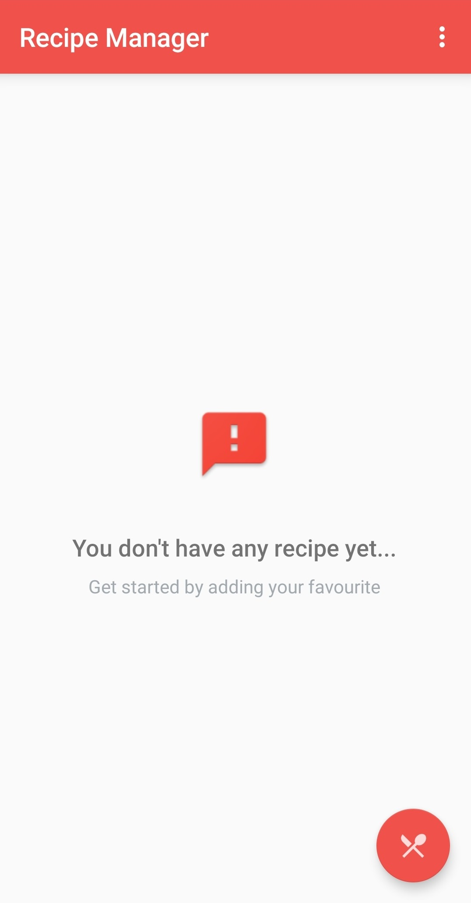

Recipe Manager App
===================================

This app displays a list of recipes and their related data that the user inputs.
Recipes can be changed and deleted.

Pre-requisites
--------------

- Android SDK v24
- Android Build Tools v23.0.3
- Android Support Repository v24.1.1

Getting Started
---------------

This sample uses the Gradle build system. To build this project, use the
"gradlew build" command or use "Import Project" in Android Studio.

Screenshoots
---------------
    
